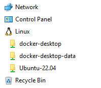
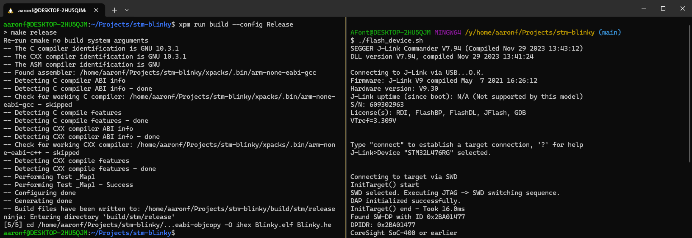
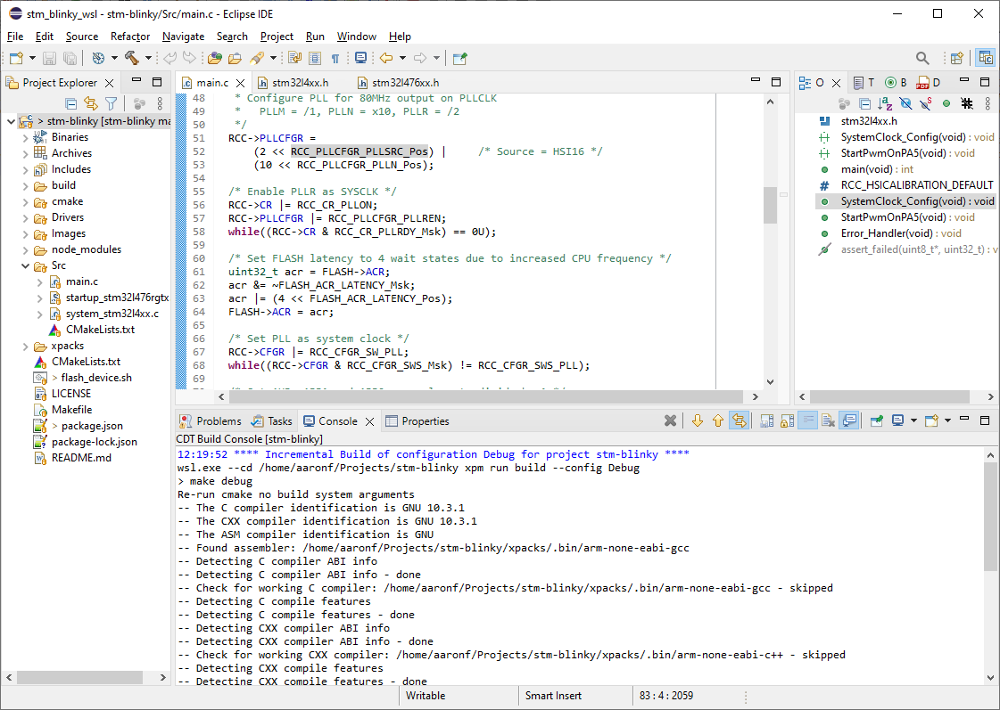
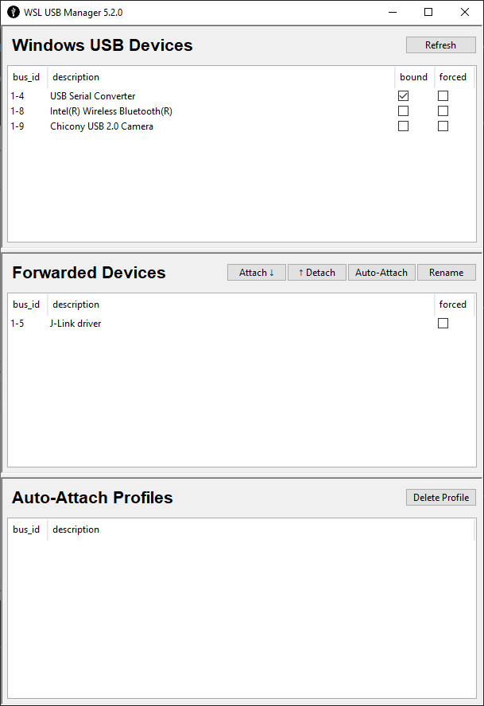
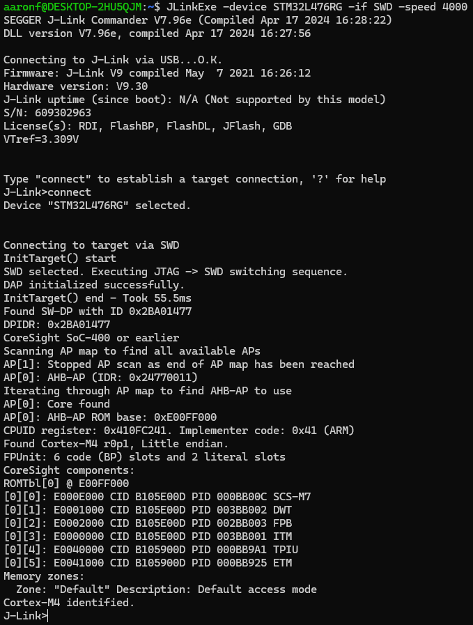

# WSL for Embedded Development <!-- omit in toc -->

- [What is WSL?](#what-is-wsl)
- [WSL Alternatives](#wsl-alternatives)
  - [Why not Mac OS?](#why-not-mac-os)
  - [Why not Docker?](#why-not-docker)
- [WSL Benefits](#wsl-benefits)
- [Getting Started with WSL](#getting-started-with-wsl)
- [WSL Integrations](#wsl-integrations)
  - [Cross-mounting of Filesystems](#cross-mounting-of-filesystems)
  - [Mapping a Drive Letter](#mapping-a-drive-letter)
  - [Network Adapter](#network-adapter)
  - [Forwarding of Windows PATH Variable](#forwarding-of-windows-path-variable)
  - [wsl.exe](#wslexe)
  - [WSL USB GUI](#wsl-usb-gui)
  - [VS Code](#vs-code)
    - [Editing and Building](#editing-and-building)
    - [Debugging and Flashing](#debugging-and-flashing)

## What is WSL?

[Windows Subsystem for Linux](https://learn.microsoft.com/en-us/windows/wsl/about) is a lightweight VM that allows you to run a Linux environment directly and easily on Windows without any other software such as VMWare or VirtualBox. It runs with a true Linux kernel (written by Microsoft and interacing with the VM) and a true ext4 filesystem (which exists as a vhdx file in the AppData folder of your C drive).

> __Note:__ This article is about WSL2, not WSL1.

## WSL Alternatives

### Why not Mac OS?

Simply put, I'm a fan of Windows. There are a lot of UI decisions that just rub me the wrong way with Mac OS. Even without WSL, cross-platform support for Windows is highly evolved. Path naming conventions, POSIX support, and use of the cmd.exe shell are not the big obstacles people make them out to be. Typically, there's either a lack of familiarity with the Windows platform, or there are issues with project setup that counteract any cross-platform support the project may have had.

All that being said, you can use WSL in your daily workflow with little to no friction. As far as POSIX-compatibility is concerned, I consider this better than Mac. There are differences with Mac OS that show themselves in projects. This can be due to using zsh instead of Bash, the differences between Apple versions of UNIX CLI utilities, differences between APFS and ext4 filesystems, issues with Apple Clang masquarading as gcc, or other nuances of being on a Mac.

IMO, seeing something work correctly in WSL is a far better litmus test that something runs correctly in CI and in containers than seeing it work correctly on a Mac.

### Why not Docker?

Memfault has already [touched on this](https://interrupt.memfault.com/blog/conda-developer-environments#common-developer-environment-alternatives), so I won't say too much more here. What I will say is that the "How do I connect to hardware?" question is far more straightforward with WSL than it is with anything like Dev Containers or GitPod.

> __Note:__ I am aware of the ability of cloud based IDEs (such as Keil Studio and Arduino Create) to connect with hardware. This is done via an agent installed on the user's machine that interacts with the browser. This article assumes no such special software in setting up a workflow.

## WSL Benefits

The primary benefit is knowing that you're operating in a true Linux environment including a Linux kernel, an ext4 filesystem, and GNU-compliant Bash shell and command-line utilities. Considering that anything running in CI is likely to be a Linux-based Docker image, this is just a cleaner way to go. I have caught many issues where something worked fine on Mac but not on Linux due to a WSL-based workflow.

The other benefit is faster build times. I have experienced much faster build times in WSL as compared to Windows. For a typical bare-metal project with a CMake/Ninja based build, a pristine build may be under 10 seconds.

> __TODO:__ Add graph of example project with build-time results for different environments.

## Getting Started with WSL

I won't cover getting started with WSL in this article, but Medium has a good article [here](https://medium.com/@awlucattini_60867/getting-started-with-wsl2-c11826654776). The only difference to it I would make is to say that Ubuntu 20.04 is outdated. Go with Ubuntu 22.04 instead.

## WSL Integrations

Let's move on to the main question: How to effectively and seamlessly integrate WSL into the development workflow. As I stated earlier, I'm not going to give a single prescription. I believe developers should have autonomy in creating their workflow. I will simply list all the ways that WSL facilitates workflow integration.

### Cross-mounting of Filesystems

If you are wondering how to access files, the good news is that Windows has you covered in both directions.

- __Accessing Windows files from WSL__
  - All Windows letter drives are mounted in the `/mnt` directory of the WSL instance.  
    E.g. `C:\Users\username\Documents` becomes `/mnt/c/Users/username/Documents`
- __Accessing WSL files from Windows__
  - All WSL instances are accessible in File Explorer as a network share beginning with `\\wsl.localhost`.  
    Additionnaly, File Explorer makes navigating to a WSL filesystem easy with a top-level "Linux" category in the folders pane.  

    

### Mapping a Drive Letter

Being able to access files within the WSL instance through a network share is powerful, but it does have some limitations. Some apps will work well with that (e.g. Balena Etcher) and others will not. To get around this, it's necessary to map the WSL instance to a drive letter. Right click on the top-level folder (e.g. "Ubuntu-22.04") and select "Map network drive...". For the drive letter, I typically choose "Y:" or "Z:". Now you should have no problem opening IDEs, editors, etc. natively in Windows to the contents of a WSL instance.

Drive letter remapping also makes it easy to navigate to files in the WSL instance from a Windows-side command shell. This is a useful trick for running flash and debug scripts. The following example shows Windows Terminal split between two views, both are pointing at the same folder. The left side is in the Ubuntu Bash shell and is used to run the build natively in WSL. The right side is in Git Bash in Windows and has `cd`ed to the drive in WSL thanks to drive letter mapping. The right side is used to flash the device.



> _Note: This image does not show the full output of the right-hand side._

### Network Adapter

Windows creates a Hyper-V Virtual Ethernet Adapter for WSL. Primarily this allows access to the Internet from WSL, but it also allows Windows-side and WSL-side applications to talk to each other via TCP/IP. This is similar to how containerized applications can communicate with the outside world via [exposed ports](https://docs.docker.com/reference/cli/docker/container/run/#publish).

To take advantage of this, you will want to know the IP address assigned to the WSL adapter from within the WSL instance. Add the following line to your `.bashrc` to assign this address to an environment variable.

```bash
export HOST_IP=`ip route|awk '/^default/{print $3}'`
```

One use for this is to connect a WSL-side GDB client to a Windows side GDB server. More details on this below.

### Forwarding of Windows PATH Variable

Type `echo $PATH` in your WSL Bash shell and you will see something interesting. After all of the paths native to the WSL instance (`/bin`, `/usr/local/bin`, etc.), you will see all of the paths from your Windows PATH variable. The only difference is that the paths are modified to work from WSL. (e.g. `C:\` is changed to `/mnt/c/`, all `;` separators changed to `:` etc.). The reason for this is that the WSL Linux kernel is designed to forward any invocation of a Windows-native application to the Windows host. This means any application accessible from the Windows command shell is also accessible from the WSL Bash shell.

Examples:

- Type `explorer.exe .` and a new instance of File Explorer will open showing the contents of the current WSL directory.
- Type `code .` and a new instance of VS Code will appear and open the current folder as a remote connection.

### wsl.exe

The wsl.exe utility is used for managing WSL instances, but it can also be used for invoking scripts within a WSL instance directly from Windows. This can be used to invoke a build script, or any other script, from an IDE residing natively in Windows. Just pass the Bash command line you want to run as an argument to `wsl.exe`. There are two options you may need before the Bash command.

- `-d` to select which distro (i.e. WSL instance) you wish to use. You only need this if the WSL instance you use for development is not already the default distro.
- `--cd` to select the working directory inside the WSL instance .

Here is an example using Eclipse to edit and build a project in WSL. Eclipse has access to the files thanks to drive letter mapping. The project is set up as a Makefile build and the build command is passed through `wsl.exe` to run it directly in Ubuntu Bash. The build shown in the CDT Build Console was started by clicking the hammer button.



> __Note:__ Setting up the debug configuration is easy here because the gdb server and client can both run natively from Windows and Eclipse has easy access to the ELF file.

### WSL USB GUI

One of the major questions people have about WSL is how to directly access their USB devices. Microsoft provides [instructions](https://learn.microsoft.com/en-us/windows/wsl/connect-usb) on how to map USB devices into a WSL instance using a tool called USB/IP. USB-over-IP is [already a supported feature](https://bresilla.com/post/hardware/raspberry/usbip/) in Linux distributions. With [usbipd-win](https://github.com/dorssel/usbipd-win), it takes advantage of the Hyper-V Virtual Ethernet Adapter to bridge devices into WSL. These show up as normal devices in `/dev`.

Using the command-line tools to set up usbipd-win correctly isn't very user friendly. Fortunately there's a [GUI](https://github.com/featherbear/wsl-usb-gui) to make things easy. Just go through [this tutorial](https://blog.golioth.io/usb-support-in-wsl2-now-with-a-gui/) from Goloith and you'll be up and running in no time.

Here is an example of what this looks like:

| JLink probe forwarded to WSL           | Use of JLink Commander from WSL              |
| -------------------------------------- | -------------------------------------------- |
|  |  |

### VS Code

#### Editing and Building

As noted previously, VS Code will automatically establish a remote connection for any folder opened from a WSL instance. The remote connection icon in the lower left corner will denote the distro you are connected to.


Since VS Code is remote connected, the terminal it opens will be your WSL Bash shell and any commands run will occur natively inside the WSL instance. This is incredibly convenient as it negates the need to pass any build commands through `wsl.exe`.

#### Debugging and Flashing

The easiest way to perform flash and debug operations is to have your debug tools installed directly into WSL and to map the corresponding USB devices into WSL using WSL USB GUI. However, you do not have to do things this way.

As noted above, it is possible to run the GDB server natively from Windows and bridge to it from the GDB client running in WSL. For this to work automatically as a VS Code launch configuration, several things have to be set up properly.

- `JLinkGDBServerCL.exe` needs to be in the path visible to WSL.
- The `HOST_IP` env var needs to be in your `.bashrc` as decribed above.
- The `Cortex Debug` launch configuration needs the server type set to `external`.
- The launch configuration should have invoke a pre-launch task, defined in `tasks.json`, to invoke `JLinkGDBServerCL.exe`.
- `JLinkGDBServerCL.exe` needs to be supplied with the `-nolocalhostonly` option so that it can be accessed from WSL's virtual Ethernet adapter.
- The gdb client needs the `target remote` as one of its startup commands with the correct IP address (`$HOST_IP`) and port (usually `2331`) to connect to the GDB server.

More details and discussion on setting this up can be found here [here](https://github.com/Marus/cortex-debug/issues/467). Note that I and many others have experienced problems with this bridging setup. You may find that the GDB client randomly disconnects from the server or that you're not able to step very far in the code base before the debug setup becomes unstable.

> _I strongly recommend WSL USB GUI over attempts to run the GDB server natively in Windows._
